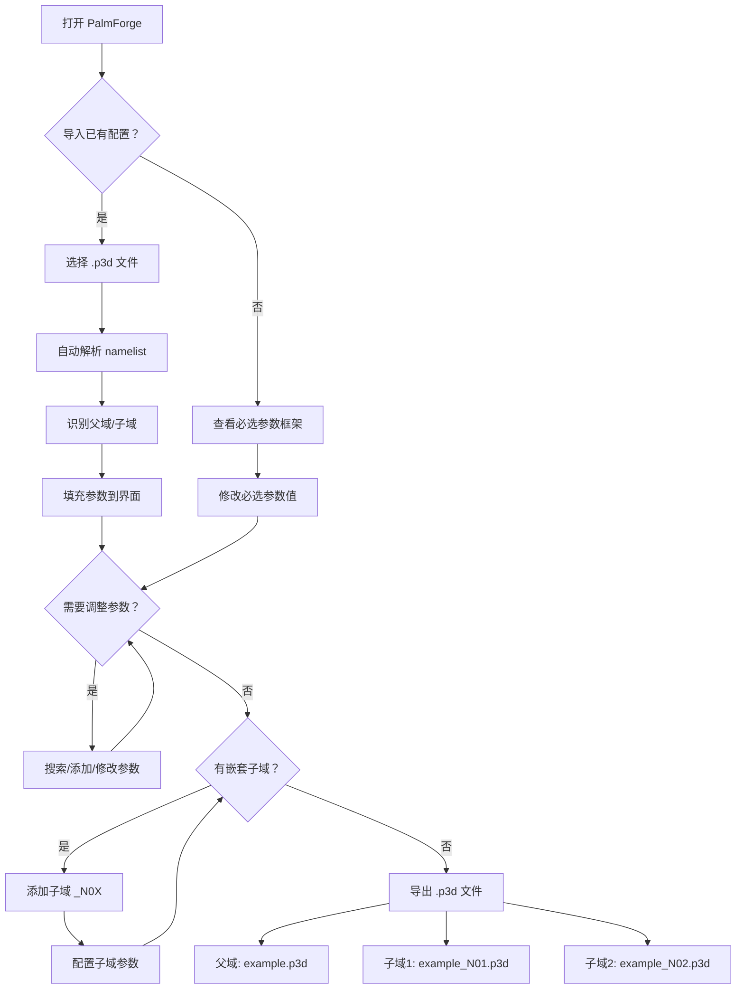

## 1. 产品概述

PalmForge（风铸）是一个 PALM 大涡模拟模型的参数配置工具，旨在帮助研究人员高效地浏览、选择和配置 PALM 模型的 874 个参数。通过可视化的 Web 界面，用户可以快速搭建模拟框架、按需添加参数、查看参数说明与默认值，并支持导入/导出规范的 .p3d 参数配置文件（含嵌套子域支持）。

- 目标用户：使用 PALM 模型进行大气模拟的研究人员和工程师
- 核心价值：将繁琐的参数查阅与配置过程可视化、结构化，大幅降低 PALM 模型的配置门槛

## 2. 核心功能

### 2.1 功能模块

1. **参数配置主页**：PALM 模拟框架搭建区，包含必选参数配置、可选参数添加、参数信息展示、配置导入导出

### 2.2 页面详情

| 页面名称 | 模块名称 | 功能描述 |
|---------|---------|---------|
| 参数配置主页 | 顶部导航栏 | 项目名称、导入按钮、导出按钮、域切换标签（父域/子域） |
| 参数配置主页 | 域管理区 | 父域与子域标签页切换，支持添加/删除子域，子域命名遵循 _N0X 规范 |
| 参数配置主页 | 必选参数框架 | 展示 PALM 核心必选参数（网格分辨率 dx/dy/dz、模拟域大小 nx/ny/nz、模拟时间 end_time 等），以卡片形式分组展示 |
| 参数配置主页 | 参数添加区 | 添加参数按钮，点击弹出参数搜索下拉框，支持按分类筛选和关键词搜索 |
| 参数配置主页 | 已添加参数列表 | 展示用户已添加的可选参数，每个参数显示名称、类型、默认值、描述，支持删除和修改值 |
| 参数配置主页 | 参数详情面板 | 侧边滑出面板，展示选中参数的完整信息（名称、分类、类型、默认值、详细描述） |
| 参数配置主页 | 导入功能 | 支持导入 .p3d 文件，自动解析 namelist 格式并填充参数；支持批量导入父域+子域文件 |
| 参数配置主页 | 导出功能 | 将当前配置导出为规范的 .p3d 参数文件；子域文件按 _N0X 命名规范导出 |

## 3. 核心流程

### 3.1 新建配置流程

用户打开 PalmForge → 查看必选参数框架（预填充默认值）→ 修改必选参数值 → 点击"添加参数"按钮 → 在下拉框中搜索/筛选参数 → 选择参数 → 查看参数默认值和描述 → 确认添加 → 继续添加其他参数 → 导出配置文件

### 3.2 导入配置流程

用户点击"导入"按钮 → 选择 .p3d 文件（可多选）→ 自动识别父域/子域 → 解析 namelist 参数 → 填充到对应域的配置界面 → 用户可继续修改 → 导出

### 3.3 嵌套域管理流程

用户在父域配置完成后 → 切换到"子域"标签 → 点击"添加子域" → 系统自动命名为 _N01 → 配置子域参数 → 可继续添加 _N02 等子域 → 导出时自动按规范命名

## 4. 用户界面设计

### 4.1 设计风格

- **主题风格**：工业科技风（Industrial-Tech），深色主题为主，搭配琥珀色/青色高亮
- **主色调**：深灰/近黑背景 (#0a0f1a)，卡片背景 (#111827)
- **强调色**：琥珀色 (#f59e0b) 用于必选参数、青色 (#06b6d4) 用于可选参数
- **按钮风格**：圆角微凸起，hover 时发光效果
- **字体**：JetBrains Mono（代码/参数名）+ Noto Sans SC（中文说明）
- **布局风格**：顶部域切换标签 + 左侧参数分类导航 + 中间参数配置区 + 右侧参数详情面板

### 4.2 页面设计概览

| 页面名称 | 模块名称 | UI 元素 |
|---------|---------|---------|
| 参数配置主页 | 顶部导航栏 | 深色背景、项目 Logo、导入按钮、导出按钮（琥珀色高亮） |
| 参数配置主页 | 域切换标签 | 父域标签（琥珀色）、子域标签（青色，带编号 _N0X），添加子域按钮 |
| 参数配置主页 | 必选参数框架 | 分组卡片（网格设置、时间设置、边界条件），输入框带单位提示 |
| 参数配置主页 | 参数添加区 | 浮动按钮（+），点击弹出搜索模态框，分类标签页 + 搜索框 + 参数列表 |
| 参数配置主页 | 已添加参数列表 | 可折叠分类列表，每项显示参数名（等宽字体）、类型标签、值输入框 |
| 参数配置主页 | 参数详情面板 | 右侧滑出面板，参数名大标题、类型/默认值标签、描述全文 |

### 4.3 响应式设计

- 桌面端优先（1920x1080 为基准）
- 参数详情面板在窄屏时改为底部弹出
- 参数搜索模态框自适应宽度

### 4.4 附加功能建议

- **参数依赖提示**：当添加的参数与其他参数有依赖关系时，自动提示相关参数
- **配置模板**：提供常用场景的预设模板（如城市冠层模拟、海风模拟等）
- **参数收藏**：用户可收藏常用参数，方便快速添加
- **配置校验**：导出前自动检查参数冲突和缺失
- **历史记录**：本地存储用户最近的配置记录
