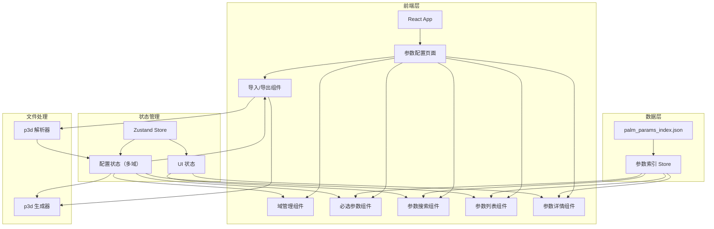

## 1. 架构设计



## 2. 技术说明

- **前端框架**：React@18 + TypeScript + Vite
- **样式方案**：Tailwind CSS@3
- **状态管理**：Zustand
- **图标库**：lucide-react
- **数据源**：本地 JSON 文件（palm_params_index.json），874 个参数静态加载
- **后端**：无（纯前端应用）
- **数据存储**：localStorage 用于保存用户配置和历史记录
- **文件处理**：FileReader API 读取 .p3d 文件，Blob API 生成下载

## 3. 路由定义

| 路由 | 用途 |
|------|------|
| / | 参数配置主页（单页应用，无额外路由） |

## 4. 数据模型

### 4.1 参数索引数据模型

```typescript
interface Parameter {
  name: string
  type: 'real' | 'integer' | 'logical' | 'character' | 'derived data-type'
  default_value: string | null
  description: string
}

interface Category {
  id: string
  name: string
  parameters: Parameter[]
}

interface PalmParamsIndex {
  categories: Category[]
}
```

### 4.2 配置状态数据模型（多域支持）

```typescript
interface ConfigParameter {
  name: string
  category: string
  type: string
  value: string
  default_value: string | null
  description: string
  isRequired: boolean
}

interface DomainConfig {
  id: string
  label: string
  isParent: boolean
  nestIndex: number | null
  parameters: ConfigParameter[]
}

interface PalmConfig {
  projectName: string
  domains: DomainConfig[]
  activeDomainId: string
  lastModified: number
}
```

### 4.3 UI 状态数据模型

```typescript
interface UIState {
  searchModalOpen: boolean
  detailPanelOpen: boolean
  selectedParameter: string | null
  searchQuery: string
  selectedCategory: string | null
  expandedCategories: string[]
}
```

### 4.4 p3d 文件数据模型

```typescript
interface P3dNamelist {
  name: string
  parameters: Record<string, string>
}

interface P3dFile {
  filename: string
  isChildDomain: boolean
  nestIndex: number | null
  namelists: P3dNamelist[]
}
```

## 5. 核心组件结构

```
src/
├── components/
│   ├── Header.tsx              # 顶部导航栏（含导入/导出按钮）
│   ├── DomainTabs.tsx          # 域切换标签（父域/子域）
│   ├── RequiredParams.tsx      # 必选参数框架
│   ├── RequiredParamCard.tsx   # 必选参数卡片
│   ├── ParamSearchModal.tsx    # 参数搜索模态框
│   ├── ParamSearchItem.tsx     # 搜索结果项
│   ├── AddedParamsList.tsx     # 已添加参数列表
│   ├── AddedParamItem.tsx      # 已添加参数项
│   ├── ParamDetailPanel.tsx    # 参数详情面板
│   ├── ImportButton.tsx        # 导入按钮
│   └── ExportButton.tsx        # 导出按钮
├── hooks/
│   ├── useParamIndex.ts        # 参数索引加载 hook
│   └── useConfigExport.ts      # 配置导出 hook
├── store/
│   ├── configStore.ts          # 配置状态管理（多域）
│   └── uiStore.ts              # UI 状态管理
├── data/
│   └── palm_params_index.json  # 参数索引数据
├── types/
│   └── index.ts                # TypeScript 类型定义
├── utils/
│   ├── parseP3d.ts             # p3d 文件解析器
│   ├── generateP3d.ts          # p3d 文件生成器
│   └── domainUtils.ts          # 域命名工具函数
├── App.tsx
└── main.tsx
```

## 6. 必选参数定义

PALM 模型的核心必选参数（预设在框架中）：

| 分组 | 参数名 | 类型 | 默认值 | 说明 |
|------|--------|------|--------|------|
| 网格设置 | dx | real | - | x 方向网格间距 (m) |
| 网格设置 | dy | real | - | y 方向网格间距 (m) |
| 网格设置 | dz | real | - | z 方向网格间距 (m) |
| 网格设置 | nx | integer | - | x 方向网格点数 |
| 网格设置 | ny | integer | - | y 方向网格点数 |
| 网格设置 | nz | integer | - | z 方向网格点数 |
| 时间设置 | end_time | real | 0.0 | 模拟结束时间 (s) |
| 初始化 | initializing_actions | character | 'inifor' | 初始化方式 |
| 边界条件 | bc_lr | character | 'cyclic' | x 方向边界条件 |
| 边界条件 | bc_ns | character | 'cyclic' | y 方向边界条件 |
| 边界条件 | bc_pt_b | character | 'dirichlet' | 底部温度边界条件 |
| 边界条件 | bc_pt_t | character | 'initial_gradient' | 顶部温度边界条件 |

## 7. p3d 文件格式规范

### 7.1 文件命名规范

| 类型 | 命名格式 | 示例 |
|------|---------|------|
| 父域 | `{project}.p3d` | `example.p3d` |
| 子域1 | `{project}_N01.p3d` | `example_N01.p3d` |
| 子域2 | `{project}_N02.p3d` | `example_N02.p3d` |
| 子域X | `{project}_N0X.p3d` | `example_N0X.p3d` |

### 7.2 文件内容格式

p3d 文件使用 Fortran namelist 格式，每个 namelist 组以 `&组名` 开始，以 `/` 结束：

```
&initialization_parameters
 dx = 10.0,
 dy = 10.0,
 dz = 10.0,
 nx = 100,
 ny = 100,
 nz = 50,
 end_time = 3600.0,
 initializing_actions = 'inifor',
 bc_lr = 'cyclic',
 bc_ns = 'cyclic',
/

&runtime_parameters
/
```

### 7.3 子域 p3d 文件示例

```
&initialization_parameters
 dx = 5.0,
 dy = 5.0,
 dz = 5.0,
 nx = 50,
 ny = 50,
 nz = 50,
 end_time = 3600.0,
 bc_lr = 'nested',
 bc_ns = 'nested',
/

&nesting_parameters
 nesting = .T.,
/

&runtime_parameters
/
```

## 8. 导入解析规则

### 8.1 文件识别

- 文件名不含 `_N0` 后缀 → 识别为父域
- 文件名含 `_N0X` 后缀（X 为数字）→ 识别为第 X 个子域
- 支持同时导入多个文件，自动分配到对应域

### 8.2 namelist 解析

- 按 `&组名` 和 `/` 分割各 namelist 组
- 每行形如 `参数名 = 值,` 的格式提取参数
- 字符串值去除引号
- 逻辑值 `.TRUE.` / `.FALSE.` 保持原样
- 数值保持原样（不添加引号）
- 忽略注释行（以 `!` 开头）
